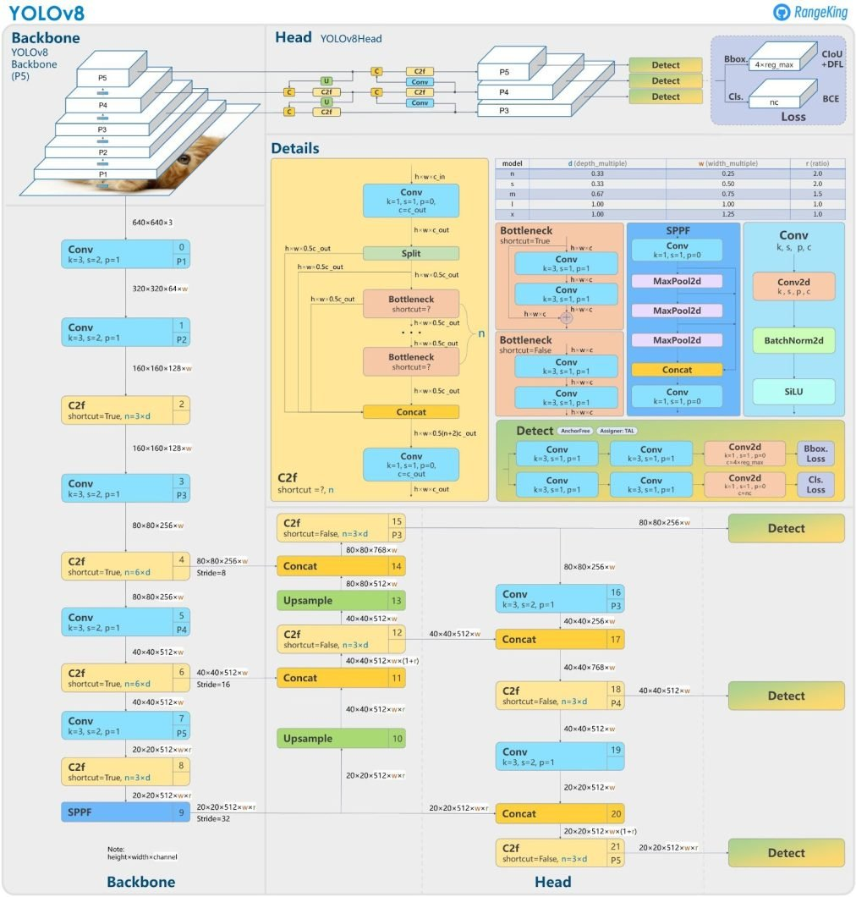

# YOLOv8

## Visão Geral

YOLOv8 (You Only Look Once) representa a última iteração na série de detectores de objetos em tempo real YOLO, oferecendo desempenho de ponta em termos de precisão e velocidade. Com avanços em relação às versões anteriores, o YOLOv8 introduz novos recursos e otimizações que o tornam uma escolha ideal para diversas tarefas de detecção de objetos em uma ampla gama de aplicações.

## Tarefas Suportadas e Modos

A série YOLOv8 oferece uma variedade de modelos especializados para tarefas específicas em visão computacional, incluindo:

- Detecção de Objetos
- Segmentação de Instâncias
- Detecção de Poses/Pontos-Chave
- Detecção de Objetos Orientados
- Classificação

Cada variante é otimizada para sua respectiva tarefa, garantindo alto desempenho e precisão.

## Uso em CPUS com Exportação ONNX

Ao exportar modelos YOLOv8 para o formato ONNX, você pode aproveitar a otimização do ONNX Runtime para execução eficiente em CPUs. Isso permite a implantação de modelos YOLOv8 em uma ampla gama de sistemas, desde servidores de alto desempenho até dispositivos embarcados, sem comprometer a velocidade ou a precisão da detecção de objetos.

A combinação do poder do YOLOv8 com a flexibilidade do formato ONNX e do ONNX Runtime oferece uma solução robusta e escalável para implantação de modelos de detecção de objetos em CPUs, garantindo alto desempenho e precisão em uma variedade de cenários de aplicação.

## Funcionamento:

O YOLOv8 baseia-se no conceito central do YOLO desenvolvido pela Ultralytics. Em essência, o YOLOv8 funciona dividindo a imagem de entrada em uma grade, geralmente com um tamanho de 13x13 ou 26x26. Cada célula da grade assume a responsabilidade de prever objetos dentro de seu domínio espacial. A seguir estão as etapas básicas do princípio de funcionamento do YOLOv8.

1. Processamento de Entrada: O YOLOv8 recebe uma imagem como entrada e a divide em uma grade, cujo tamanho varia conforme o modelo:

    * YOLO Tiny: Grade de 13x13, ideal para dispositivos com menor capacidade de processamento.
    * YOLO Small, Medium, Large, X-Large (S, M, L, X): Grades de 13x13, 26x26, e até 52x52, ajustadas para diferentes níveis de desempenho e precisão.

    Estas grades permitem ao YOLO detectar objetos em diferentes escalas, melhorando a detecção de objetos de vários tamanhos na imagem de entrada.

2.  Extração de Características: A rede extrai características de alto nível da imagem de entrada usando uma rede neural convolucional profunda (CNN). A escolha da arquitetura da rede geralmente é baseada em modelos estabelecidos como o ResNeXt ou Darknet que representam maneiras específicas de construir a CNN.

3. Previsão da Caixa Delimitadora: O YOLOv8 prevê a caixa delimitadora para objetos regredindo as coordenadas do canto superior esquerdo, largura e altura da caixa. Além disso, calcula uma pontuação de confiança que indica a probabilidade de que a caixa prevista contenha o objeto.
   
4. Previsão de Classes: Junto com as previsões das caixas delimitadoras, o YOLOv8 também prevê probabilidades de classes para cada célula da grade. Isso significa que o modelo pode não apenas detectar objetos, mas também identificar suas categorias relativas.
   
5. Pós-Processamento: Uma vez feitas as previsões, um limiar de confiança é aplicado para filtrar as detecções de baixa confiança. A supressão não-máxima é então usada para remover caixas delimitadoras duplicadas ou sobrepostas, garantindo que apenas as previsões mais precisas continuem.

## Diagrama YOLOv8

A arquitetura do YOLOv8 foi escolhida por utilizar o modelo n, que está sendo utilizada no projeto, conhecido por sua eficiência em termos de velocidade e leveza. Ela incorpora componentes essenciais para realizar a detecção de objetos de forma eficiente. Abaixo, na imagem 1, temos o diagrama apresentando todas as etapas.

  <b>Diagrama YOLOv8</b> (Fonte: <a href="https://github.com/ultralytics/ultralytics/issues/189">RangeKing</a>)

### Backbone

O Backbone é composto por uma série de camadas convolucionais que extraem as características mais importantes da imagem de entrada.

### Camada SPPF

A camada SPPF, juntamente com as camadas convolucionais subsequentes, processa as características em diversas escalas. As camadas de Upsample aumentam a resolução dos mapas de características, aprimorando os detalhes.

### Módulo C2f

O módulo C2f combina características de alto nível com informações contextuais, melhorando a precisão e a robustez da detecção.

### Detecção

Por fim, o módulo de detecção utiliza uma combinação de camadas convolucionais e lineares para transformar as características de alta dimensão em caixas delimitadoras e classes de objetos na saída.